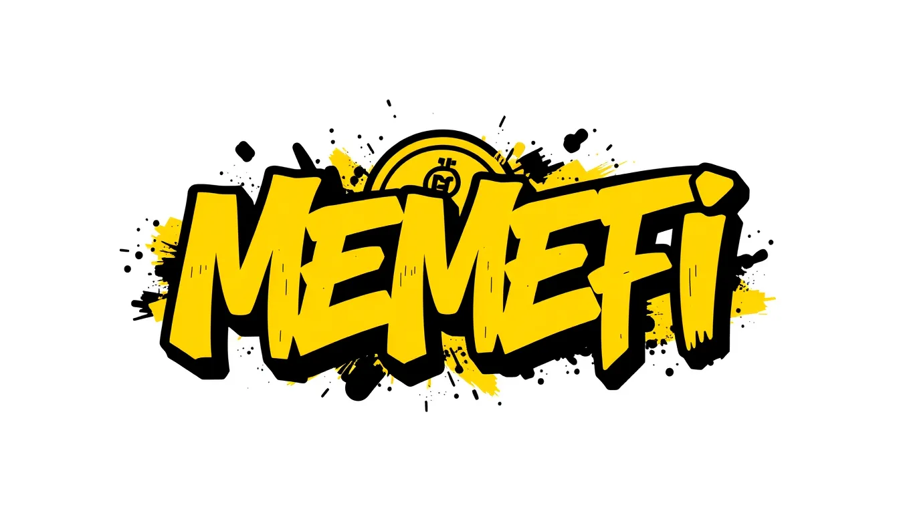

# MEMEFI - The Perfect Fusion of Meme Culture and DeFi

<div align="center">
  
  <br>
  <h3>🚀 "Ownership Equals Wealth" 🚀</h3>
  <p>A Community-Driven Wealth Ecosystem on Binance Smart Chain</p>
  
  [](https://opensource.org/licenses/MIT)
  
  
</div>

## 🌟 Overview

MEMEFI represents the perfect fusion of Meme culture and Decentralized Finance (DeFi), designed to revitalize the cryptocurrency market through a powerful economic model, high community consensus, and innovative token mechanisms.

Our motto: **"Sellers regret, holders earn dividends."** MEMEFI transcends the typical Meme coin project, establishing itself as a holder-centric ecosystem that drives value growth through dynamic taxation and follow-up mechanisms.

## 🔗 Important Links

- **Website**: [https://memefinancebsc.github.io/](https://memefinancebsc.github.io/)
- **Whitepaper**: [https://memefi-sorganization.gitbook.io/doc.memefi](https://memefi-sorganization.gitbook.io/doc.memefi)
- **Smart Contract**: [https://bscscan.com/](https://bscscan.com/)
- **Audit Report**: [https://gopluslabs.io/token-security/56/](https://gopluslabs.io/token-security/56/)

## 💰 Token Information

- **Name**: MEMEFI
- **Symbol**: MMF
- **Blockchain**: Binance Smart Chain (BSC)
- **Token Standard**: BEP-20
- **Total Supply**: 100,000,000 MMF

## 🔥 Key Features

- **Community-Driven Governance**: Token holders have voting rights on project decisions
- **Dynamic Taxation System**: Rewards long-term holders while discouraging short-term speculation
- **Referral Program**: Earn 5% bonus tokens for each person you refer
- **Deflationary Mechanism**: Automatic token burns to reduce supply over time
- **Liquidity Lock**: Initial liquidity locked to ensure project stability

## 📊 Tokenomics

| Allocation | Percentage | Description |
|------------|------------|-------------|
| Public Sale | 40% | Available through IDO |
| Liquidity Pool | 25% | Locked for 1 year |
| Team | 15% | Vested over 2 years |
| Marketing | 10% | For promotional activities |
| Ecosystem | 10% | For partnerships and development |

### Tax Distribution

- **Buy Tax**: 5%
  - 3% to holders as MMF dividends
  - 2% to liquidity pool

- **Sell Tax**: 10%
  - 5% to holders as MMF dividends
  - 3% to liquidity pool
  - 2% to marketing wallet

## 🛣️ Roadmap

### Phase 1: Launch
- Initial Coin Offering (ICO)
- Website and social media launch
- Community building initiatives
- Initial marketing campaigns
- Listing on DEX platforms

### Phase 2: Growth
- CEX listings
- Partnership announcements
- Enhanced marketing campaigns
- Community expansion initiatives
- Development of additional features

### Phase 3: Expansion
- Development of DeFi ecosystem
- Launch of staking platform
- Cross-chain integration
- Strategic partnerships
- Expansion of use cases

### Phase 4: Maturity
- Governance system implementation
- DAO establishment
- Ecosystem expansion
- Long-term sustainability measures
- Community-led development initiatives

## 💻 Technical Stack

- **Frontend**: HTML5, CSS3, JavaScript
- **Framework**: Bootstrap 5
- **Web3 Integration**: Web3.js
- **Smart Contracts**: Solidity
- **Blockchain**: Binance Smart Chain

## 🚀 Getting Started

1. Clone the repository:
```bash
git clone https://github.com/yourusername/memefi.git
cd memefi
```

2. Open the project in your browser:
```bash
# If you have Python installed
python -m http.server 8000
# Then visit http://localhost:8000
```

3. Connect your wallet and participate in the IDO.

## 📱 Connect With Us

<div align="center">
  
[](https://x.com/MemeFi_bsc)
[](https://t.me/BSC_memefinance)

</div>

## 📄 License

This project is licensed under the MIT License - see the [LICENSE](LICENSE) file for details.

## ⚠️ Disclaimer

Cryptocurrency investments are volatile and high-risk. The information provided in this repository is for educational purposes only and does not constitute financial advice. Always conduct your own research before investing.

---

<div align="center">
  <p>© 2025 MEMEFI. All Rights Reserved.</p>
  <p>Made with ❤️ by the MEMEFI Team</p>
</div> 